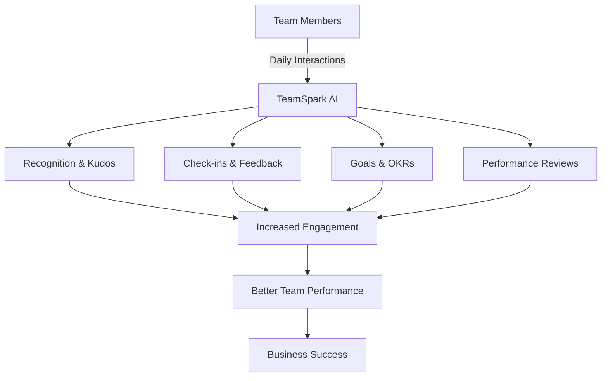
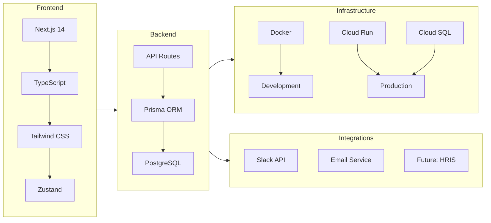
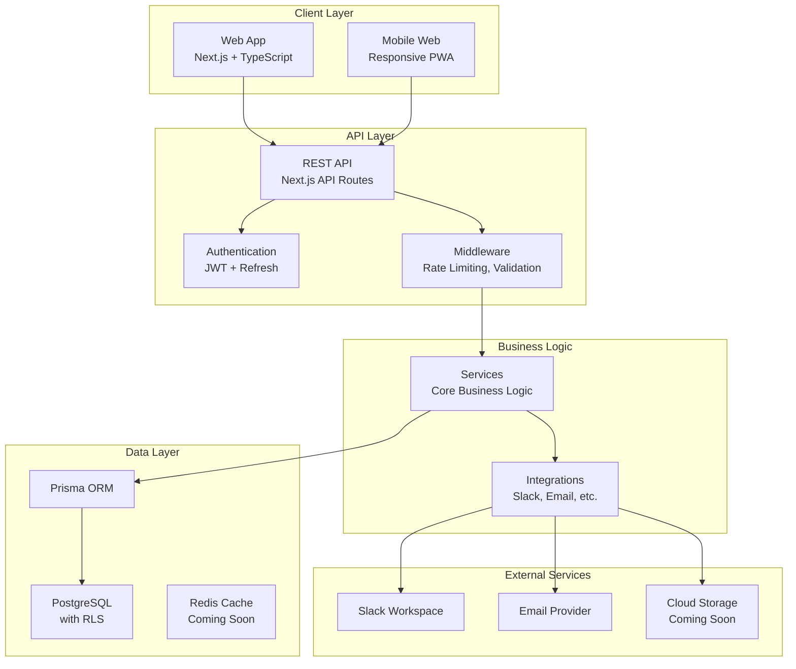
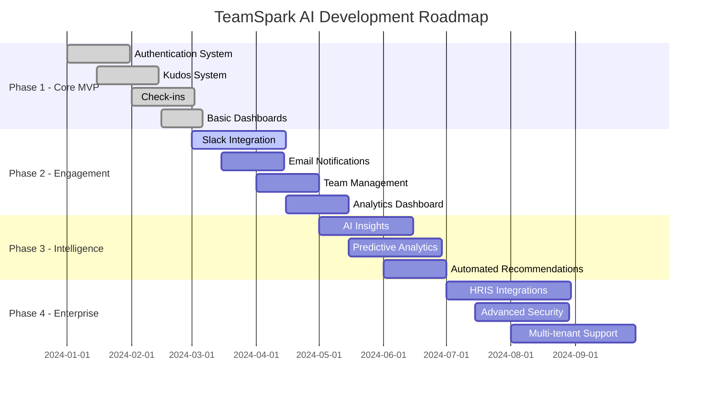

# TeamSpark AI

🚀 **AI-powered team communication and engagement platform**

## 🎯 Product Vision

TeamSpark AI is an intelligent platform that **unlocks team potential** by creating a dynamic environment where teams naturally collaborate, recognize achievements, and grow together. It's not just an HR tool—it's your team's AI-powered growth partner.



## 🌟 Core Features

### Currently Available

#### 📊 **Peer Recognition (Kudos) System**

- Send appreciation across different categories (gratitude, collaboration, achievement)
- Points-based gamification system
- Slack integration with `/kudos` command
- Real-time notifications

#### ✅ **Customizable Check-ins**

- Flexible frequency: daily, weekly, bi-weekly, monthly, quarterly
- Custom question templates aligned with company culture
- Mood tracking and sentiment analysis
- Historical insights and growth patterns

#### 📝 **Performance Management**

- Complete evaluation cycle management
- Self-assessment forms with auto-save
- Manager review workflows
- Foundation for 360-degree feedback

#### 🎯 **OKR Management**

- Objective and Key Result tracking
- Progress visualization
- Regular check-in prompts
- Team and individual goal alignment

#### 💬 **Slack Integration** (Optional)

- Workspace-level OAuth integration
- Slash commands for quick actions
- Real-time DM notifications
- Works independently—core features don't require Slack

#### 📱 **Real-time Dashboards**

- Personal engagement metrics
- Team activity feeds
- Customizable widgets (coming soon)
- Mobile-responsive design

## 🛠️ Technology Stack



- **Frontend**: Next.js 14 (App Router), TypeScript, Tailwind CSS, Zustand
- **Backend**: Next.js API Routes, Prisma ORM
- **Database**: PostgreSQL (Docker for dev, Cloud SQL for production)
- **Authentication**: JWT-based with refresh tokens
- **Infrastructure**: Docker, Google Cloud Run, GitHub Actions
- **External Integrations**: Slack API, Email notifications

## Getting Started

### Prerequisites

- Node.js v18.0.0 or higher
- Docker (for Supabase Local)
- npm v9.0.0 or higher

### Quick Start

```bash
# 1. Install dependencies
npm install

# 2. Environment setup (first time only)
cp .env.example .env.local

# 3. Start development server (with pre-flight checks)
npm run dev:safe
```

For detailed setup instructions, see:

- [Setup Guide](./docs/guides/setup.md) - Complete setup instructions
- [Environment Setup](./docs/setup/ENVIRONMENT_SETUP.md) - Environment variables and direnv configuration

## Development Guide

### Important Documentation

- [CLAUDE.md](./CLAUDE.md) - AI Developer Guidelines
- [Development Plan](./docs/development/plan.md) - Detailed development todos
- [Architecture](./docs/development/architecture.md) - System design
- [Setup Guide](./docs/guides/setup.md) - Detailed environment setup instructions

### Command List

```bash
# Development
npm run dev:safe     # Start dev server with pre-flight checks (recommended)
npm run dev          # Start dev server normally
npm run build        # Production build
npm run start        # Start production server
npm run pre-flight   # Environment pre-flight check

# Code Quality
npm run lint         # Run ESLint
npm run type-check   # TypeScript check
npm run format       # Prettier formatting
npm run validate     # Run all checks

# Testing
npm run test:db:setup    # Setup test database (Docker)
npm test                 # Run E2E tests
npm run test:headed      # Run tests with browser display
npm run test:stories     # Run user story tests
npm run test:with-db     # Setup DB, run tests, teardown DB
npm run test:db:teardown # Stop test database

# User Stories
npm run validate:stories  # Generate story validation report
npm run report:stories    # Story test report

# Database
npm run prisma:generate  # Generate Prisma Client
npm run prisma:migrate   # Run migrations
npm run prisma:studio    # Start Prisma Studio
npm run prisma:reset     # Reset DB (development only)

# Supabase
npm run supabase:start   # Start Supabase
npm run supabase:stop    # Stop Supabase
npm run supabase:status  # Check status

# Utilities
npm run check:ports  # Check port conflicts
npm run health       # Health check
npm run verify       # Server verification
```

## Project Structure

```
.
├── src/
│   ├── app/              # Next.js App Router
│   ├── components/       # React components
│   ├── lib/             # Utility functions
│   │   └── user-stories/ # User story management
│   ├── services/        # Business logic
│   ├── stores/          # Zustand state management
│   ├── hooks/           # Custom hooks
│   └── types/           # TypeScript type definitions
├── tests/
│   └── e2e/
│       └── stories/     # Story-based tests
├── prisma/
│   ├── schema.prisma    # Database schema
│   └── migrations/      # Migration files
├── scripts/             # Utility scripts
├── public/              # Static files
└── docs/                # Documentation
```

## Testing

### E2E Testing with Docker

This project uses Docker for test database setup. Tests run against a PostgreSQL container.

#### Quick Test Run

```bash
# Run tests with automatic database setup/teardown
npm run test:with-db
```

#### Manual Test Setup

```bash
# 1. Start test database
npm run test:db:setup

# 2. Run tests
npm test

# 3. Stop test database (when done)
npm run test:db:teardown
```

#### Test Database Configuration

- **Host**: localhost
- **Port**: 54322
- **Database**: team_spark_test
- **User**: postgres
- **Password**: postgres

The test database runs in Docker and is completely isolated from your development environment.

## 🏗️ Architecture Overview



## 🚀 Product Roadmap



## 💡 Competitive Advantages

1. **Privacy-First Design**: Cookie-free i18n, GDPR/CCPA compliant
2. **Modern Architecture**: Built with latest technologies for optimal performance
3. **Flexible Integration**: Works with or without external services
4. **User Story-Driven**: Every feature tied to real business value
5. **AI-Ready**: Foundation for advanced AI features and insights

## 📈 Impact Metrics

Based on industry standards, organizations using TeamSpark AI can expect:

- **30-40%** increase in employee engagement scores
- **25%** reduction in turnover rates
- **2x** more peer recognition activities
- **80%** participation in regular check-ins
- **15%** improvement in team productivity

## Contributing

Contributions are welcome! Please see [CONTRIBUTING.md](CONTRIBUTING.md) for details.

## Development Notes

### Schema Change Procedure

1. Modify Prisma schema
2. Run `npx prisma migrate dev --name change_description`
3. Run `npx prisma generate`
4. Check for type errors with `npm run type-check`
5. Update all related code

For details, see the "Preventing and Handling Schema Mismatch Errors" section in [CLAUDE.md](./CLAUDE.md).

## Support

If you have questions or issues, please let us know via [Issues](https://github.com/your-org/startup-hr/issues).
