# TeamSpark AI - Technical Architecture

## 🏗️ System Architecture Overview

TeamSpark AI is built using a modern, scalable architecture designed for high performance, security, and maintainability.

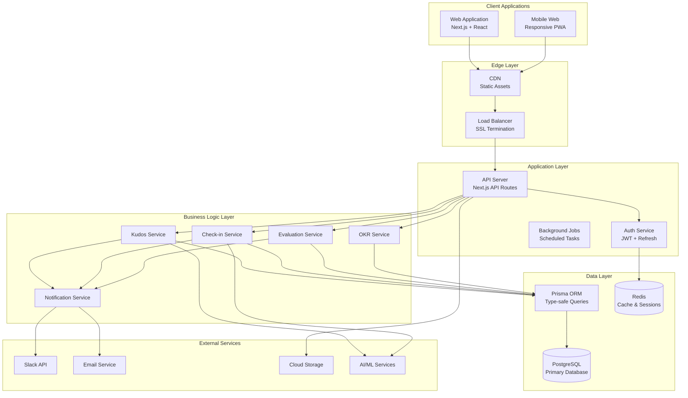

## 🔧 Technology Stack Details

### Frontend Architecture

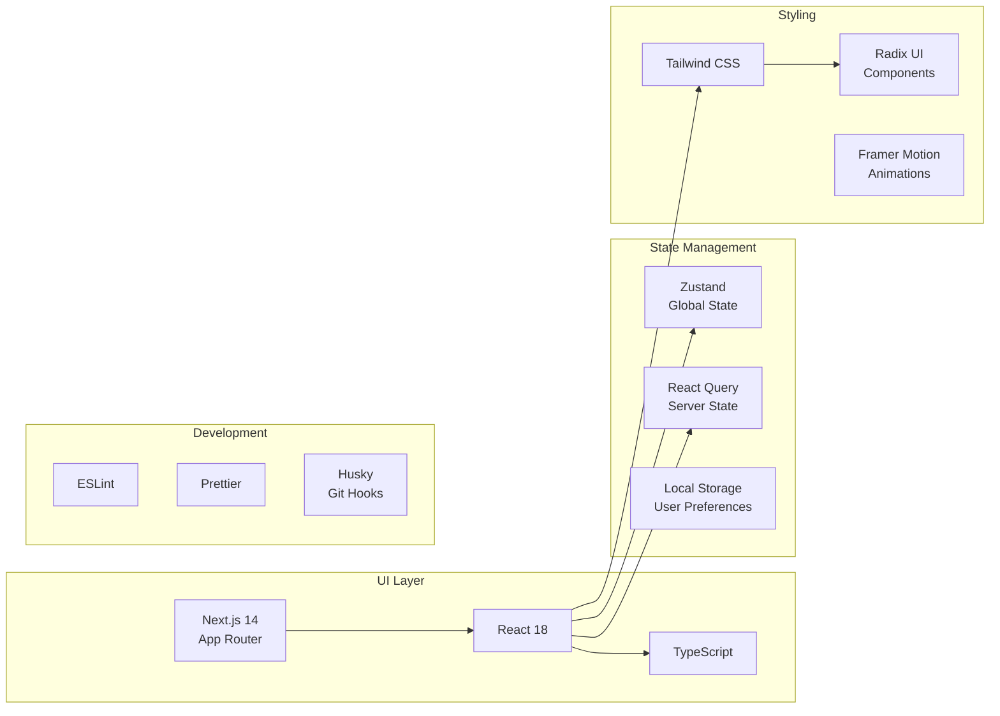

### Backend Architecture

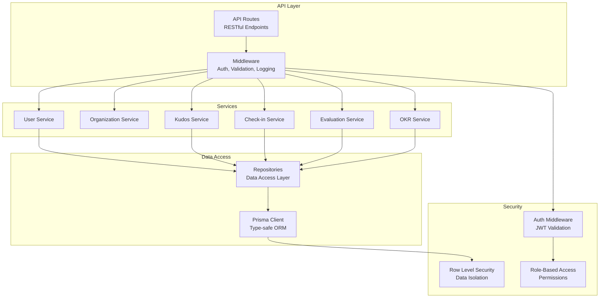

## 🗄️ Database Architecture

### Entity Relationship Diagram

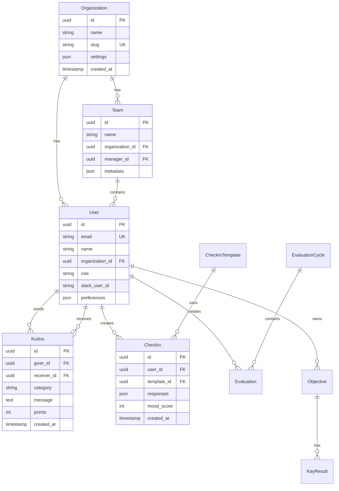

### Database Security Model

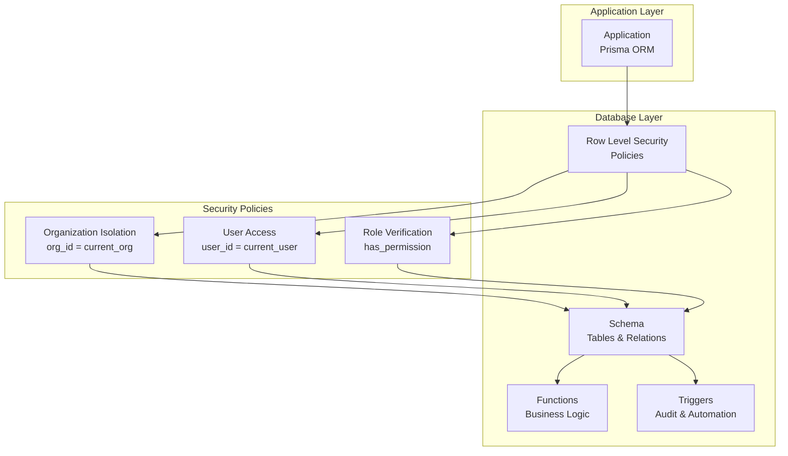

## 🔐 Security Architecture

### Authentication Flow

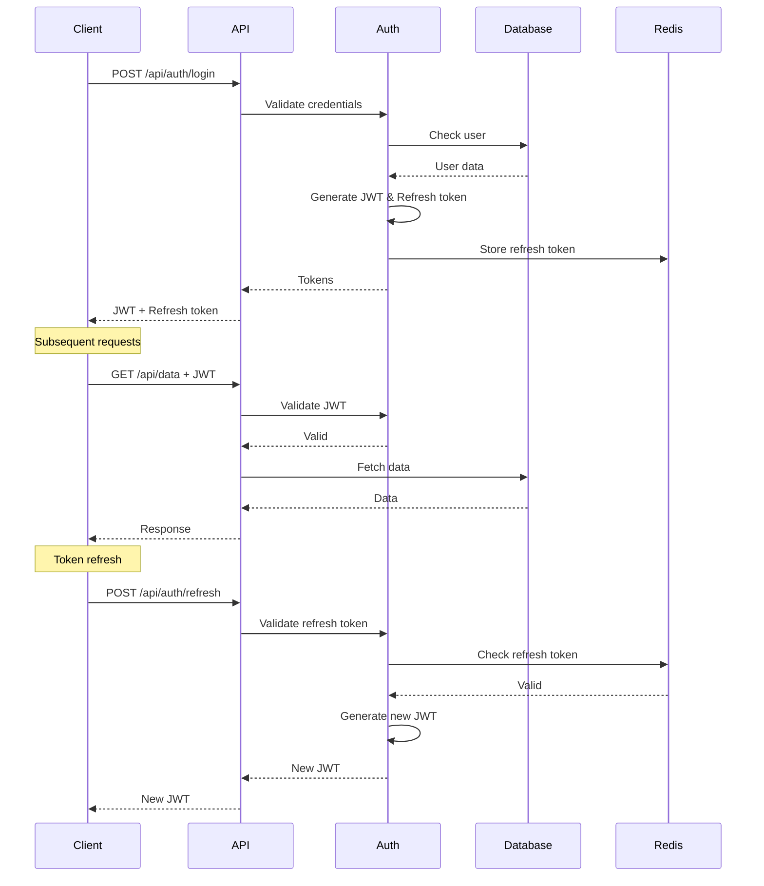

### Authorization Model

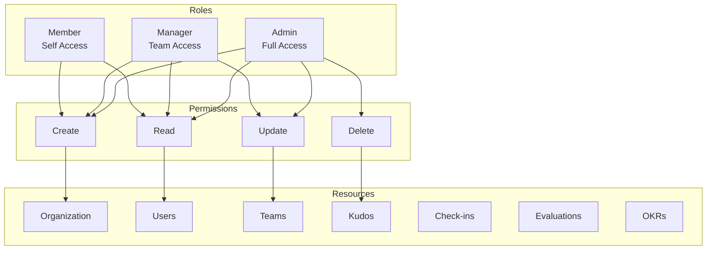

## 🚀 Deployment Architecture

### Development Environment

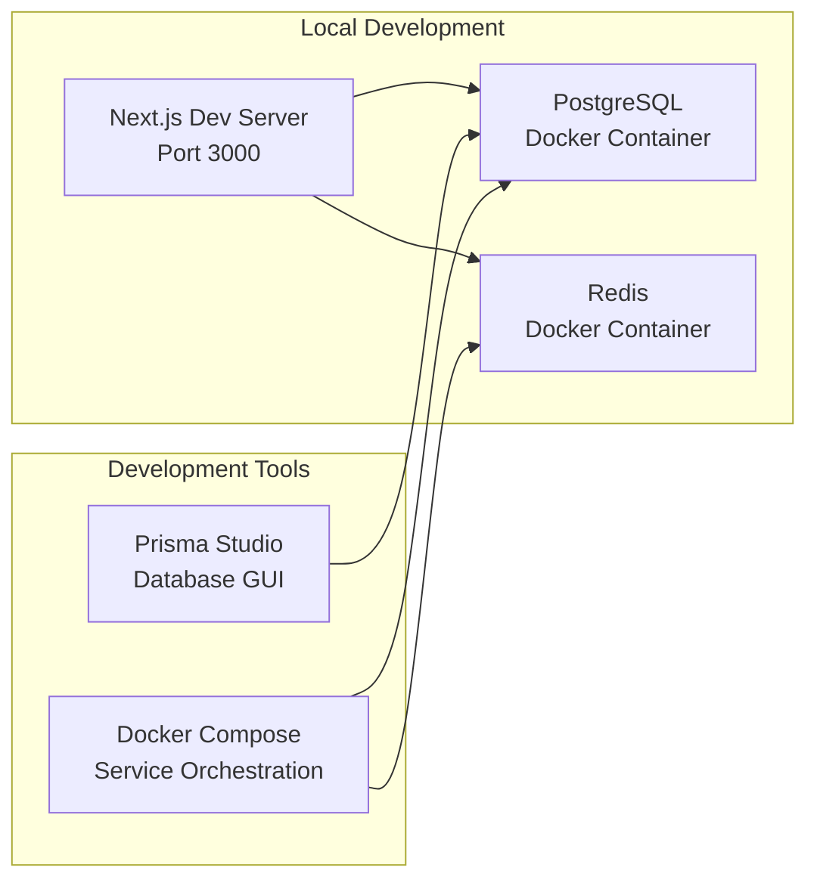

### Production Environment (Google Cloud)

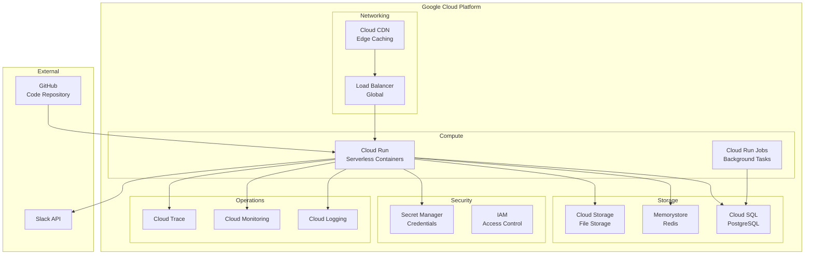

## 📊 Performance Architecture

### Caching Strategy

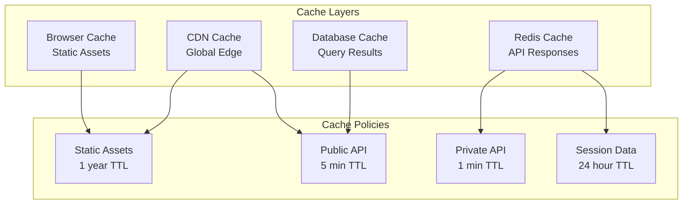

### Scalability Design

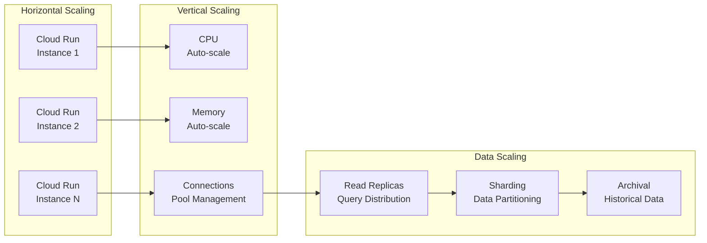

## 🔄 Integration Architecture

### Slack Integration

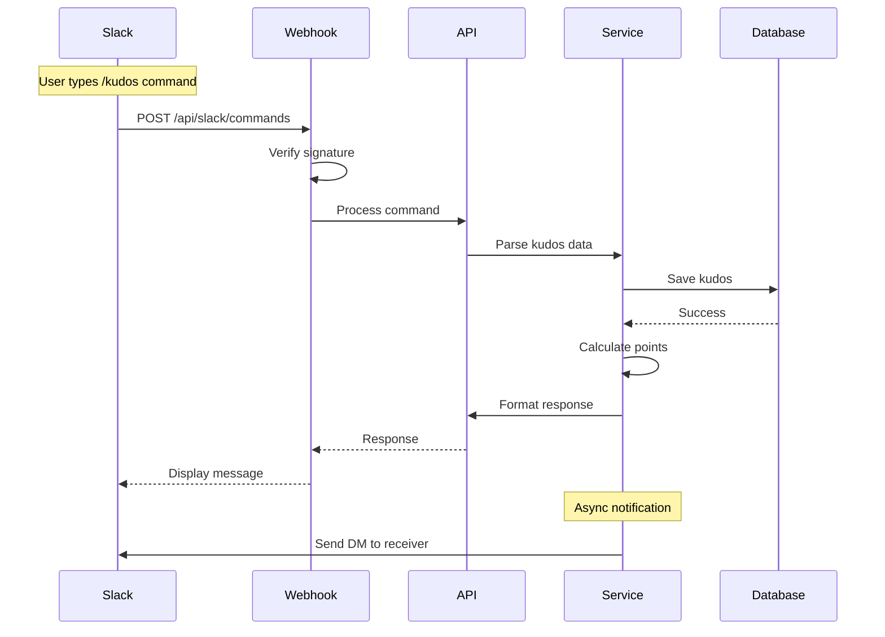

### Future AI Integration

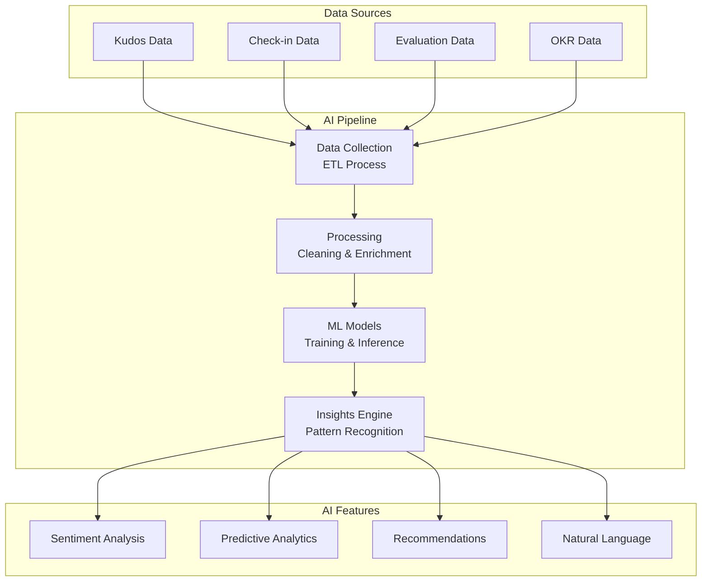

## 🛡️ Monitoring & Observability

### Monitoring Stack

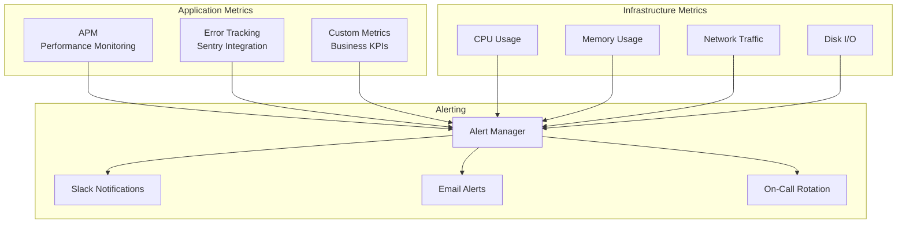

## 📈 Performance Optimization

### Frontend Optimization

- Code splitting with dynamic imports
- Image optimization with Next.js Image
- Bundle size monitoring
- Progressive Web App capabilities
- Lazy loading for non-critical components

### Backend Optimization

- Database query optimization with indexes
- Connection pooling for database efficiency
- Caching strategy for frequently accessed data
- Async job processing for heavy operations
- Serverless-optimized cold start reduction

### Database Optimization

- Proper indexing strategy
- Query performance monitoring
- Periodic vacuum and analyze
- Partitioning for large tables
- Read replica for analytics queries

## 🔮 Future Architecture Considerations

1. **Microservices Migration**: Consider breaking monolith into services as scale demands
2. **Event-Driven Architecture**: Implement event sourcing for better audit trails
3. **GraphQL Gateway**: Consider GraphQL for more flexible client queries
4. **Multi-Region Deployment**: Global distribution for international usage
5. **Kubernetes Migration**: For more complex orchestration needs

---

This architecture is designed to scale from startup to enterprise while maintaining simplicity, security, and performance.
