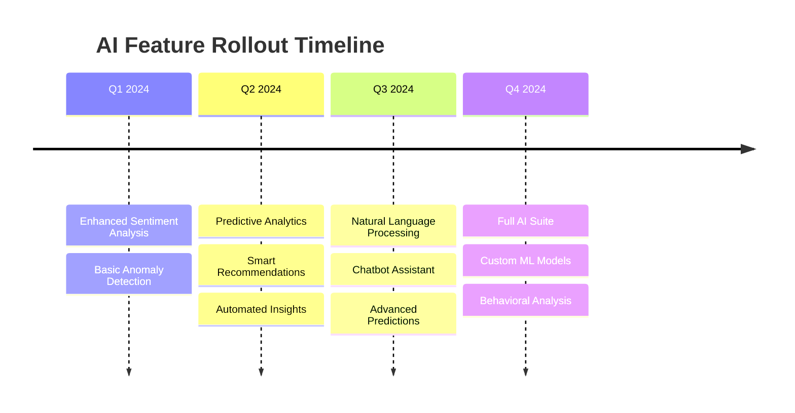
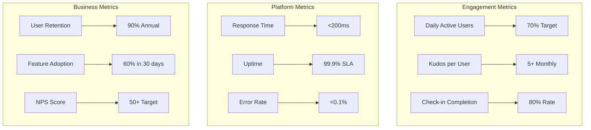

# TeamSpark AI - Feature Status

## 📊 Feature Implementation Status

### Legend

- ✅ **Complete**: Fully implemented and tested
- 🚧 **In Progress**: Currently being developed
- 📅 **Planned**: Scheduled for future development
- 💡 **Ideation**: Under consideration

## 🎯 Core Features Status

### Authentication & User Management

| Feature            | Status      | Details                  | Target  |
| ------------------ | ----------- | ------------------------ | ------- |
| User Registration  | ✅ Complete | Email-based registration | -       |
| JWT Authentication | ✅ Complete | Access & refresh tokens  | -       |
| Role-Based Access  | ✅ Complete | Admin, Manager, Member   | -       |
| Password Reset     | 📅 Planned  | Email-based recovery     | Q2 2024 |
| SSO Integration    | 📅 Planned  | Okta, Auth0, SAML        | Q3 2024 |
| 2FA Support        | 📅 Planned  | TOTP, SMS options        | Q3 2024 |

### Kudos System

| Feature               | Status         | Details                    | Target  |
| --------------------- | -------------- | -------------------------- | ------- |
| Send Kudos (Web)      | ✅ Complete    | Category-based recognition | -       |
| Kudos Points          | ✅ Complete    | Configurable point values  | -       |
| Kudos Feed            | ✅ Complete    | Real-time activity feed    | -       |
| Slack Command         | 🚧 In Progress | /kudos @user category msg  | Q1 2024 |
| Kudos Analytics       | 📅 Planned     | Trends and insights        | Q2 2024 |
| Badges & Achievements | 📅 Planned     | Milestone rewards          | Q2 2024 |

### Check-in System

| Feature             | Status      | Details                    | Target  |
| ------------------- | ----------- | -------------------------- | ------- |
| Template Management | ✅ Complete | Custom question templates  | -       |
| Flexible Scheduling | ✅ Complete | Daily to quarterly options | -       |
| Mood Tracking       | ✅ Complete | 1-5 scale with emoji       | -       |
| Response History    | ✅ Complete | View past check-ins        | -       |
| Automated Reminders | 📅 Planned  | Email/Slack notifications  | Q1 2024 |
| Team Aggregation    | 📅 Planned  | Manager team views         | Q2 2024 |

### Performance Management

| Feature              | Status      | Details                  | Target  |
| -------------------- | ----------- | ------------------------ | ------- |
| Self-Evaluation      | ✅ Complete | Comprehensive forms      | -       |
| Manager Review       | ✅ Complete | Approval workflow        | -       |
| Evaluation Cycles    | ✅ Complete | Configurable periods     | -       |
| 360 Feedback         | 📅 Planned  | Peer feedback collection | Q2 2024 |
| Calibration Sessions | 📅 Planned  | HR distribution tools    | Q3 2024 |
| Goal Integration     | 📅 Planned  | Link to OKRs             | Q2 2024 |

### OKR Management

| Feature               | Status      | Details                  | Target  |
| --------------------- | ----------- | ------------------------ | ------- |
| Create Objectives     | ✅ Complete | With key results         | -       |
| Progress Tracking     | ✅ Complete | Visual indicators        | -       |
| Check-in Updates      | ✅ Complete | Regular progress updates | -       |
| Cascading OKRs        | 📅 Planned  | Company to individual    | Q2 2024 |
| OKR Analytics         | 📅 Planned  | Success metrics          | Q2 2024 |
| Public/Private Toggle | 📅 Planned  | Visibility controls      | Q1 2024 |

## 🔌 Integration Status

### Slack Integration

```mermaid
graph LR
    subgraph "Implemented"
        A[OAuth Flow] -->|✅| B[Workspace Connection]
        C[User Linking] -->|✅| D[Profile Integration]
    end

    subgraph "In Progress"
        E[Slash Commands] -->|🚧| F[/kudos Command]
        G[Notifications] -->|🚧| H[DM Alerts]
    end

    subgraph "Planned"
        I[App Home] -->|📅| J[Dashboard View]
        K[Workflows] -->|📅| L[Automated Actions]
    end
```

### Email Notifications

| Feature             | Status     | Details               | Target  |
| ------------------- | ---------- | --------------------- | ------- |
| Welcome Emails      | 📅 Planned | New user onboarding   | Q1 2024 |
| Kudos Notifications | 📅 Planned | When kudos received   | Q1 2024 |
| Check-in Reminders  | 📅 Planned | Scheduled reminders   | Q1 2024 |
| Weekly Digests      | 📅 Planned | Team activity summary | Q2 2024 |
| Custom Templates    | 📅 Planned | Branded emails        | Q2 2024 |

### External Integrations

| Integration      | Status      | Details              | Target  |
| ---------------- | ----------- | -------------------- | ------- |
| Google Calendar  | 📅 Planned  | Check-in scheduling  | Q2 2024 |
| Microsoft Teams  | 📅 Planned  | Alternative to Slack | Q3 2024 |
| HRIS Systems     | 📅 Planned  | BambooHR, Workday    | Q3 2024 |
| Jira Integration | 💡 Ideation | Link OKRs to tickets | Q4 2024 |
| Zapier/Make      | 💡 Ideation | Workflow automation  | Q4 2024 |

## 📱 Platform Features

### Dashboard & Analytics

| Feature            | Status         | Details               | Target  |
| ------------------ | -------------- | --------------------- | ------- |
| Personal Dashboard | ✅ Complete    | Individual metrics    | -       |
| Team Dashboard     | 🚧 In Progress | Manager views         | Q1 2024 |
| Org Analytics      | 📅 Planned     | Company-wide insights | Q2 2024 |
| Custom Reports     | 📅 Planned     | Configurable exports  | Q2 2024 |
| Real-time Updates  | ✅ Complete    | Live data refresh     | -       |
| Mobile Responsive  | ✅ Complete    | All screen sizes      | -       |

### User Experience

| Feature            | Status      | Details                 | Target  |
| ------------------ | ----------- | ----------------------- | ------- |
| Dark Mode          | 📅 Planned  | Theme switching         | Q1 2024 |
| Keyboard Shortcuts | 📅 Planned  | Power user features     | Q2 2024 |
| Bulk Actions       | 📅 Planned  | Multi-select operations | Q2 2024 |
| Advanced Search    | 📅 Planned  | Full-text search        | Q2 2024 |
| User Preferences   | ✅ Complete | Notification settings   | -       |
| Multi-language     | ✅ Complete | EN/JA support           | -       |

## 🤖 AI & Intelligence Features

### Current AI Capabilities

| Feature           | Status         | Details              | Target  |
| ----------------- | -------------- | -------------------- | ------- |
| Basic Sentiment   | ✅ Complete    | Simple text analysis | -       |
| Pattern Detection | 🚧 In Progress | Engagement patterns  | Q1 2024 |

### Planned AI Features



## 🔒 Security & Compliance

### Security Features

| Feature           | Status         | Details              | Target  |
| ----------------- | -------------- | -------------------- | ------- |
| Data Encryption   | ✅ Complete    | At rest & in transit | -       |
| RLS Policies      | ✅ Complete    | Database isolation   | -       |
| Audit Logging     | 🚧 In Progress | Activity tracking    | Q1 2024 |
| GDPR Compliance   | ✅ Complete    | Data privacy         | -       |
| SOC 2 Preparation | 📅 Planned     | Compliance audit     | Q3 2024 |
| Pen Testing       | 📅 Planned     | Security audit       | Q2 2024 |

## 🚀 Infrastructure & DevOps

### Deployment & Scaling

| Feature         | Status         | Details                | Target  |
| --------------- | -------------- | ---------------------- | ------- |
| Docker Support  | ✅ Complete    | Local development      | -       |
| CI/CD Pipeline  | ✅ Complete    | GitHub Actions         | -       |
| Cloud Run Ready | 🚧 In Progress | Production deployment  | Q1 2024 |
| Auto-scaling    | 📅 Planned     | Traffic-based scaling  | Q1 2024 |
| Multi-region    | 💡 Ideation    | Global deployment      | 2025    |
| Kubernetes      | 💡 Ideation    | Advanced orchestration | 2025    |

## 📈 Success Metrics

### Key Performance Indicators



## 🎯 Q1 2024 Sprint Plan

### Sprint 1 (Weeks 1-2)

- [ ] Complete Slack slash command implementation
- [ ] Deploy production infrastructure on Cloud Run
- [ ] Implement email notification system base

### Sprint 2 (Weeks 3-4)

- [ ] Launch team dashboard features
- [ ] Add check-in reminder notifications
- [ ] Implement audit logging framework

### Sprint 3 (Weeks 5-6)

- [ ] Complete Slack DM notifications
- [ ] Add dark mode support
- [ ] Enhance pattern detection AI

### Sprint 4 (Weeks 7-8)

- [ ] Performance optimization for scale
- [ ] Security audit preparation
- [ ] Q2 planning and prioritization

## 📞 Feature Requests & Feedback

We actively collect and prioritize feature requests from our users. Current top requests:

1. **Mobile App** (Native iOS/Android)
2. **Microsoft Teams Integration**
3. **Advanced Analytics Dashboard**
4. **Custom Branding Options**
5. **API Access for Integrations**

---

_Last Updated: January 2024_
_For feature requests, please contact the product team or submit via JIRA (TSA project)_
