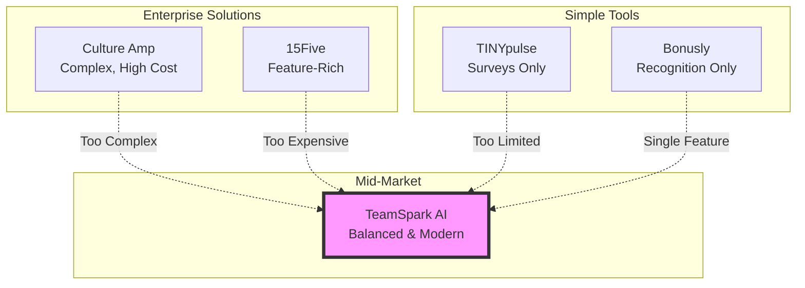
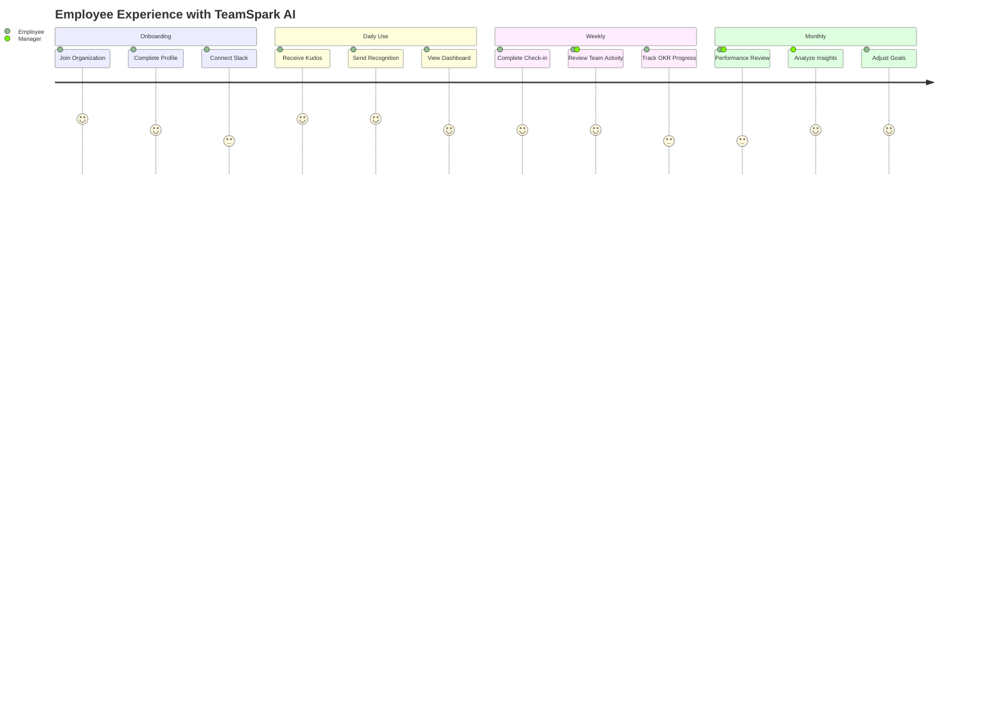
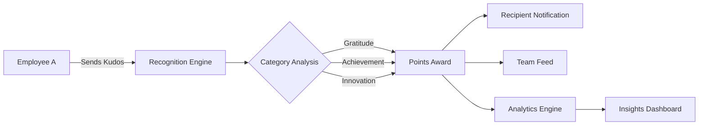
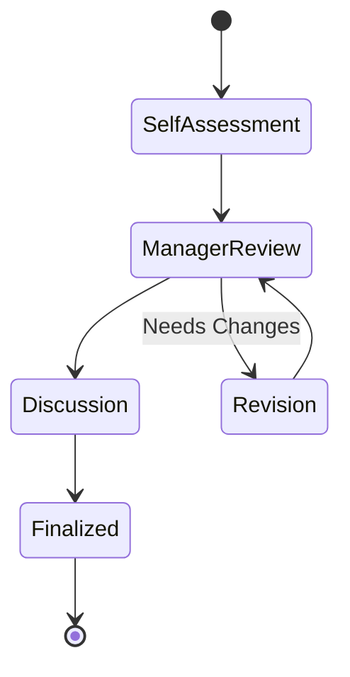
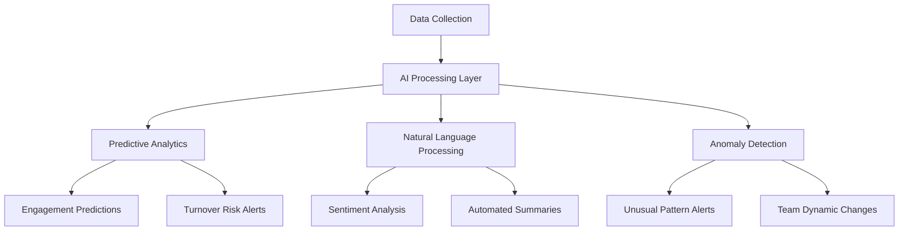
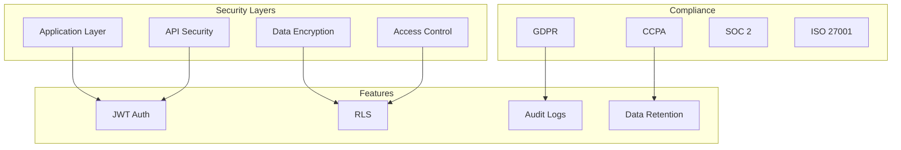

# TeamSpark AI - Product Overview

## 🎯 Executive Summary

TeamSpark AI is an AI-powered employee engagement platform that transforms how teams communicate, collaborate, and grow together. By combining peer recognition, structured feedback, goal management, and AI-driven insights, it creates a comprehensive solution for building high-performing, engaged teams.

## 🌍 Market Positioning

### Competitive Advantages

| Feature             | TeamSpark AI    | 15Five      | Culture Amp   | Officevibe | Bonusly     |
| ------------------- | --------------- | ----------- | ------------- | ---------- | ----------- |
| Peer Recognition    | ✅ Advanced     | ✅ Basic    | ✅ Basic      | ❌         | ✅ Advanced |
| Check-ins           | ✅ Customizable | ✅ Fixed    | ✅ Complex    | ✅ Simple  | ❌          |
| Performance Reviews | ✅ Flexible     | ✅ Rigid    | ✅ Enterprise | ❌         | ❌          |
| OKR Management      | ✅ Integrated   | ✅ Separate | ❌            | ❌         | ❌          |
| AI Insights         | 🚧 Coming       | ❌          | ✅ Limited    | ❌         | ❌          |
| Slack Integration   | ✅ Native       | ✅ Basic    | ✅ Basic      | ✅ Good    | ✅ Good     |
| Privacy-First       | ✅ No Cookies   | ❌          | ❌            | ❌         | ❌          |
| Modern Tech         | ✅ 2024 Stack   | ❌ Legacy   | ❌ Legacy     | ❌ Legacy  | ✅ Modern   |

## 🎨 Product Philosophy

### Core Principles

1. **Human-Centered AI**: Technology should amplify human connections, not replace them
2. **Privacy by Design**: User data protection is fundamental, not an afterthought
3. **Flexibility First**: One size doesn't fit all—customization is key
4. **Continuous Growth**: Both the product and its users should constantly evolve
5. **Data-Driven Decisions**: Insights should lead to actionable improvements

## 🔄 User Journey

## 📊 Feature Deep Dive

### 1. Intelligent Recognition System

**Key Capabilities:**

- Multi-category recognition (gratitude, teamwork, innovation, etc.)
- Point-based rewards system
- Public and private recognition options
- Integration with performance reviews
- Trend analysis and reporting

### 2. Adaptive Check-in System

**Flexibility at its Core:**

- **Frequency Options**: Daily, Weekly, Bi-weekly, Monthly, Quarterly
- **Custom Questions**: Tailored to team culture and goals
- **Smart Scheduling**: Skip holidays, adjust for time zones
- **AI Suggestions**: Question recommendations based on team dynamics

### 3. Comprehensive Performance Management

### 4. OKR Ecosystem

**Alignment & Transparency:**

- Cascading objectives from company to individual
- Real-time progress tracking
- Check-in integration
- Visual progress indicators
- Historical performance data

## 🤖 AI-Powered Future

### Current AI Features

- Basic sentiment analysis in feedback
- Pattern recognition in engagement data
- Automated insights generation

### Upcoming AI Capabilities

1. **Predictive Analytics**

   - Engagement trend forecasting
   - Turnover risk identification
   - Performance prediction models

2. **Smart Recommendations**

   - Personalized action items
   - Team intervention suggestions
   - Optimal check-in timing

3. **Natural Language Intelligence**
   - Advanced sentiment analysis
   - Feedback summarization
   - Multilingual support expansion

## 📈 Success Metrics

### For Organizations

- **Employee Engagement Score**: Track overall organizational health
- **Recognition Frequency**: Measure culture of appreciation
- **Check-in Participation**: Monitor continuous feedback adoption
- **Goal Achievement Rate**: Assess OKR effectiveness

### For Individuals

- **Personal Growth Trajectory**: Visualize career development
- **Peer Recognition Score**: Understand team impact
- **Feedback Quality**: Improve communication skills
- **Goal Progress**: Track personal achievements

## 🔒 Security & Compliance

## 🌐 Integration Ecosystem

### Current Integrations

- **Slack**: Deep integration with commands and notifications
- **Email**: Comprehensive notification system
- **Calendar**: Coming soon

### Planned Integrations

- **HRIS**: BambooHR, Workday, ADP
- **SSO**: Okta, Auth0, Active Directory
- **Project Management**: Jira, Asana, Monday.com
- **Communication**: Microsoft Teams, Zoom
- **Analytics**: Tableau, PowerBI

## 🚀 Implementation Timeline

### Quick Start (Week 1-2)

1. Organization setup
2. User onboarding
3. Slack integration
4. First kudos & check-ins

### Full Adoption (Month 1-3)

1. Performance cycle setup
2. OKR framework implementation
3. Team structure configuration
4. Analytics baseline establishment

### Optimization (Month 3+)

1. AI insights activation
2. Advanced integrations
3. Custom workflows
4. ROI measurement

## 💡 Use Cases by Industry

### Technology Companies

- Agile team retrospectives
- Sprint performance tracking
- Innovation recognition
- Remote team engagement

### Healthcare Organizations

- Shift feedback collection
- Patient care recognition
- Compliance tracking
- Team wellness monitoring

### Education Institutions

- Faculty peer reviews
- Student feedback integration
- Department goal alignment
- Research collaboration tracking

### Financial Services

- Compliance culture building
- Performance benchmarking
- Risk management insights
- Team productivity analysis

## 📞 Support & Resources

- **Documentation**: Comprehensive guides and API docs
- **Training**: Onboarding sessions and video tutorials
- **Community**: User forums and best practices sharing
- **Support**: 24/7 technical assistance (Enterprise plan)

## 🎯 Vision Statement

TeamSpark AI envisions a future where every team member feels valued, heard, and empowered to do their best work. By combining the efficiency of AI with the warmth of human connection, we're building the foundation for the next generation of high-performing, deeply engaged teams.

---

_TeamSpark AI - Where Teams Thrive Together_
