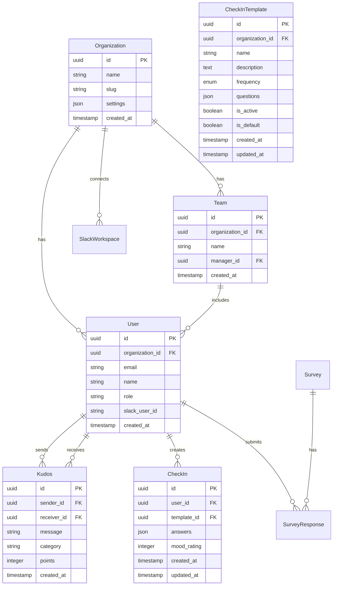

# システムアーキテクチャ設計書

## 1. システム概要

### 1.1 プロジェクト名

Startup HR Engagement Platform

### 1.2 目的

スタートアップ企業向けに、従業員エンゲージメントの向上と評価管理を支援するSaaSプラットフォームを提供する。

### 1.3 主要機能

- ピア評価（Kudos）システム
- カスタマイズ可能なチェックイン（頻度・質問設定可）
- パルスサーベイ
- Slack統合
- リアルタイムダッシュボード

## 2. 技術スタック

### 2.1 フロントエンド

- **Framework**: Next.js 14 (App Router)
- **Language**: TypeScript 5.x
- **Styling**: Tailwind CSS
- **State Management**: Zustand
- **Form Handling**: React Hook Form + Zod
- **UI Components**: Radix UI
- **Charts**: Recharts

### 2.2 バックエンド

- **API**: Next.js API Routes
- **ORM**: Prisma
- **Validation**: Zod
- **Background Jobs**: Vercel Cron Jobs

### 2.3 インフラストラクチャ

- **Database**: PostgreSQL (Supabase)
- **Authentication**: Supabase Auth
- **File Storage**: Supabase Storage
- **Hosting**: Vercel
- **Monitoring**: Vercel Analytics
- **Error Tracking**: Sentry

### 2.4 外部連携

- **Slack**: Slack SDK for Node.js (Bolt)
- **Email**: Resend
- **Analytics**: PostHog

## 3. システムアーキテクチャ

### 3.1 全体構成図

```
┌─────────────────┐     ┌─────────────────┐     ┌─────────────────┐
│                 │     │                 │     │                 │
│   Web Client    │────▶│   Next.js App   │────▶│    Supabase     │
│  (Browser/PWA)  │     │   (Vercel)      │     │   (Database)    │
│                 │     │                 │     │                 │
└─────────────────┘     └────────┬────────┘     └─────────────────┘
                                 │
                                 │
                        ┌────────▼────────┐
                        │                 │
                        │   Slack API     │
                        │                 │
                        └─────────────────┘
```

### 3.2 レイヤーアーキテクチャ

```
┌─────────────────────────────────────────────────────┐
│                  Presentation Layer                  │
│         (React Components, Pages, Hooks)            │
├─────────────────────────────────────────────────────┤
│                  Application Layer                   │
│          (Business Logic, Services)                 │
├─────────────────────────────────────────────────────┤
│                    Domain Layer                      │
│           (Entities, Value Objects)                 │
├─────────────────────────────────────────────────────┤
│                Infrastructure Layer                  │
│     (Database, External APIs, File System)         │
└─────────────────────────────────────────────────────┘
```

## 4. データモデル

### 4.1 主要エンティティ



### 4.2 データベーススキーマ（Prisma）

```prisma
model Organization {
  id        String   @id @default(cuid())
  name      String
  slug      String   @unique
  settings  Json     @default("{}")
  createdAt DateTime @default(now())
  updatedAt DateTime @updatedAt

  users           User[]
  teams           Team[]
  slackWorkspaces SlackWorkspace[]
}

model User {
  id             String   @id @default(cuid())
  organizationId String
  email          String   @unique
  name           String
  role           Role     @default(MEMBER)
  slackUserId    String?
  createdAt      DateTime @default(now())
  updatedAt      DateTime @updatedAt

  organization    Organization @relation(fields: [organizationId], references: [id])
  sentKudos       Kudos[]      @relation("SentKudos")
  receivedKudos   Kudos[]      @relation("ReceivedKudos")
  checkIns        CheckIn[]
  surveyResponses SurveyResponse[]
  managedTeams    Team[]
}

enum Role {
  ADMIN
  MANAGER
  MEMBER
}
```

## 5. API設計

### 5.1 RESTful API エンドポイント

```
# 認証
POST   /api/auth/signup
POST   /api/auth/login
POST   /api/auth/logout
POST   /api/auth/refresh

# 組織
GET    /api/organizations/:id
PUT    /api/organizations/:id
POST   /api/organizations/:id/invite

# ユーザー
GET    /api/users/me
PUT    /api/users/me
GET    /api/users

# Kudos
POST   /api/kudos
GET    /api/kudos
GET    /api/kudos/received
GET    /api/kudos/sent

# チェックイン
POST   /api/checkins
GET    /api/checkins
GET    /api/checkins/:userId

# サーベイ
POST   /api/surveys
GET    /api/surveys
POST   /api/surveys/:id/responses
GET    /api/surveys/:id/results

# Slack
POST   /api/slack/connect
POST   /api/slack/disconnect
POST   /api/slack/commands
POST   /api/slack/events
```

### 5.2 Slack Slash Commands

```
/kudos @user [message]    - Kudosを送信
/checkin                  - チェックインを開始
/mood [1-10]             - 気分を記録
/dashboard               - ダッシュボードリンクを表示
```

## 6. セキュリティ設計

### 6.1 認証・認可

- **認証方式**: JWT + Refresh Token
- **セッション管理**: Supabase Auth Session
- **権限管理**: Role-Based Access Control (RBAC)
  - Admin: 全機能へのアクセス
  - Manager: チームメンバーのデータ閲覧
  - Member: 自分のデータと公開情報のみ

### 6.2 データ保護

- **暗号化**: TLS 1.3（通信）、AES-256（保存時）
- **個人情報**: GDPR/CCPA準拠
- **データ分離**: Row Level Security (RLS)
- **監査ログ**: 全ての重要操作を記録

### 6.3 API セキュリティ

- **Rate Limiting**: 100 requests/minute per user
- **CORS**: 許可されたドメインのみ
- **Input Validation**: Zod によるスキーマ検証
- **SQL Injection対策**: Prisma ORM使用

## 7. パフォーマンス設計

### 7.1 キャッシング戦略

- **CDN**: Vercel Edge Network
- **API Cache**: Redis (Upstash)
- **Database Cache**: Prisma Query Caching
- **Static Generation**: 可能な限りSSG使用

### 7.2 最適化手法

- **Code Splitting**: Dynamic Imports
- **Image Optimization**: Next.js Image Component
- **Database Index**: 頻繁にクエリされるカラム
- **Connection Pooling**: Prisma Connection Pool

## 8. スケーラビリティ

### 8.1 水平スケーリング

- **アプリケーション**: Vercel Auto-scaling
- **データベース**: Supabase Read Replicas
- **キャッシュ**: Redis Cluster

### 8.2 負荷分散

- **Global CDN**: Vercel Edge Network
- **Database Load Balancing**: Supabase自動管理
- **API Rate Limiting**: Per-user quotas

## 9. 監視・運用

### 9.1 モニタリング

- **APM**: Vercel Analytics
- **Error Tracking**: Sentry
- **Uptime Monitoring**: Better Stack
- **Database Monitoring**: Supabase Dashboard

### 9.2 ログ管理

- **Application Logs**: Vercel Functions Logs
- **Error Logs**: Sentry
- **Audit Logs**: Custom implementation
- **Access Logs**: Vercel Edge Logs

## 10. 災害復旧

### 10.1 バックアップ

- **Database**: 日次自動バックアップ（30日保持）
- **File Storage**: Supabase Storage replication
- **Configuration**: Git version control

### 10.2 復旧計画

- **RTO**: 4時間
- **RPO**: 24時間
- **Failover**: Supabase自動フェイルオーバー

## 11. 開発・デプロイフロー

### 11.1 ブランチ戦略

```
main (production)
  └── develop
       ├── feature/xxx
       ├── bugfix/xxx
       └── hotfix/xxx
```

### 11.2 CI/CD パイプライン

1. **開発**: ローカル開発 → feature branch
2. **テスト**: 自動テスト実行（GitHub Actions）
3. **レビュー**: Pull Request → Code Review
4. **ステージング**: develop branch → Vercel Preview
5. **本番**: main branch → Vercel Production

## 12. 今後の拡張性

### 12.1 機能拡張

- GraphQL API対応
- WebSocket（リアルタイム機能）
- モバイルアプリ（React Native）
- AI/ML機能（感情分析、予測）

### 12.2 インテグレーション

- Microsoft Teams
- Google Workspace
- HR情報システム（HRIS）
- 給与システム

## 13. 技術的決定事項

### 13.1 なぜNext.js 14？

- App Routerによる優れたDX
- Server Componentsでパフォーマンス向上
- Vercelとの統合が容易
- TypeScriptサポートが優秀

### 13.2 なぜSupabase？

- オープンソース
- ローカル開発環境が充実
- 認証・DB・ストレージが統合
- Row Level Securityが強力

### 13.3 なぜPrisma？

- 型安全性
- マイグレーション管理
- 優れたDX
- 複数DBサポート
