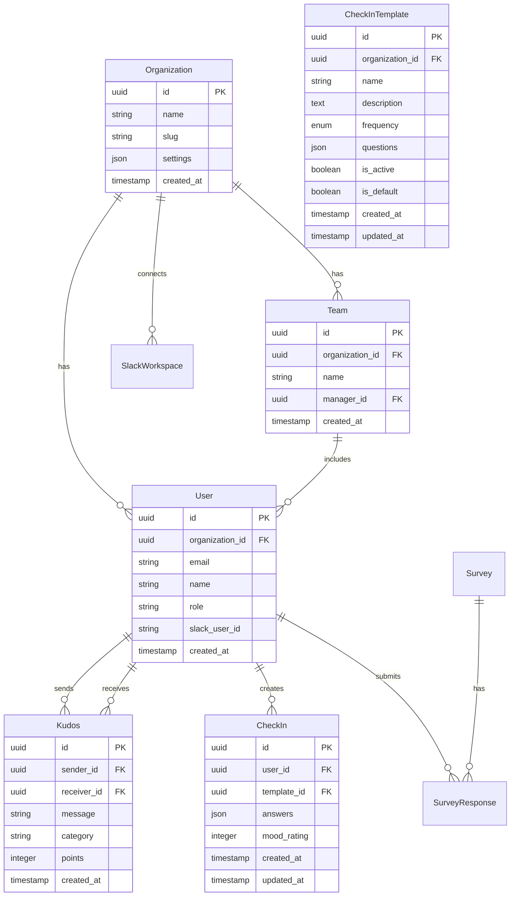

# System Architecture Design Document

## 1. System Overview

### 1.1 Project Name

TeamSpark AI

### 1.2 Purpose

To provide an AI-powered team communication and engagement platform that enhances team collaboration and performance.

### 1.3 Key Features

- Peer recognition (Kudos) system
- Customizable check-ins (configurable frequency and questions)
- Pulse surveys
- Slack integration
- Real-time dashboard

## 2. Technology Stack

### 2.1 Frontend

- **Framework**: Next.js 14 (App Router)
- **Language**: TypeScript 5.x
- **Styling**: Tailwind CSS
- **State Management**: Zustand
- **Form Handling**: React Hook Form + Zod
- **UI Components**: Radix UI
- **Charts**: Recharts

### 2.2 Backend

- **API**: Next.js API Routes
- **ORM**: Prisma
- **Validation**: Zod
- **Background Jobs**: Vercel Cron Jobs

### 2.3 Infrastructure

- **Database**: PostgreSQL (Docker for dev, Cloud SQL for production)
- **Authentication**: JWT-based with refresh tokens
- **File Storage**: Cloud Storage (Coming Soon)
- **Hosting**: Vercel
- **Monitoring**: Vercel Analytics
- **Error Tracking**: Sentry

### 2.4 External Integrations

- **Slack**: Slack SDK for Node.js (Bolt)
- **Email**: Resend
- **Analytics**: PostHog

## 3. System Architecture

### 3.1 Overall Architecture Diagram

```
┌─────────────────┐     ┌─────────────────┐     ┌─────────────────┐
│                 │     │                 │     │                 │
│   Web Client    │────▶│   Next.js App   │────▶│   PostgreSQL    │
│  (Browser/PWA)  │     │   (Vercel)      │     │   (Database)    │
│                 │     │                 │     │                 │
└─────────────────┘     └────────┬────────┘     └─────────────────┘
                                 │
                                 │
                        ┌────────▼────────┐
                        │                 │
                        │   Slack API     │
                        │                 │
                        └─────────────────┘
```

### 3.2 Layer Architecture

```
┌─────────────────────────────────────────────────────┐
│                  Presentation Layer                  │
│         (React Components, Pages, Hooks)            │
├─────────────────────────────────────────────────────┤
│                  Application Layer                   │
│          (Business Logic, Services)                 │
├─────────────────────────────────────────────────────┤
│                    Domain Layer                      │
│           (Entities, Value Objects)                 │
├─────────────────────────────────────────────────────┤
│                Infrastructure Layer                  │
│     (Database, External APIs, File System)         │
└─────────────────────────────────────────────────────┘
```

## 4. Data Model

### 4.1 Main Entities



### 4.2 Database Schema (Prisma)

```prisma
model Organization {
  id        String   @id @default(cuid())
  name      String
  slug      String   @unique
  settings  Json     @default("{}")
  createdAt DateTime @default(now())
  updatedAt DateTime @updatedAt

  users           User[]
  teams           Team[]
  slackWorkspaces SlackWorkspace[]
}

model User {
  id             String   @id @default(cuid())
  organizationId String
  email          String   @unique
  name           String
  role           Role     @default(MEMBER)
  slackUserId    String?
  createdAt      DateTime @default(now())
  updatedAt      DateTime @updatedAt

  organization    Organization @relation(fields: [organizationId], references: [id])
  sentKudos       Kudos[]      @relation("SentKudos")
  receivedKudos   Kudos[]      @relation("ReceivedKudos")
  checkIns        CheckIn[]
  surveyResponses SurveyResponse[]
  managedTeams    Team[]
}

enum Role {
  ADMIN
  MANAGER
  MEMBER
}
```

## 5. API Design

### 5.1 RESTful API Endpoints

```
# Authentication
POST   /api/auth/signup
POST   /api/auth/login
POST   /api/auth/logout
POST   /api/auth/refresh

# Organizations
GET    /api/organizations/:id
PUT    /api/organizations/:id
POST   /api/organizations/:id/invite

# Users
GET    /api/users/me
PUT    /api/users/me
GET    /api/users

# Kudos
POST   /api/kudos
GET    /api/kudos
GET    /api/kudos/received
GET    /api/kudos/sent

# Check-ins
POST   /api/checkins
GET    /api/checkins
GET    /api/checkins/:userId

# Surveys
POST   /api/surveys
GET    /api/surveys
POST   /api/surveys/:id/responses
GET    /api/surveys/:id/results

# Slack
POST   /api/slack/connect
POST   /api/slack/disconnect
POST   /api/slack/commands
POST   /api/slack/events
```

### 5.2 Slack Slash Commands

```
/kudos @user [message]    - Send kudos
/checkin                  - Start check-in
/mood [1-10]             - Record mood
/dashboard               - Show dashboard link
```

## 6. Security Design

### 6.1 Authentication & Authorization

- **Authentication Method**: JWT + Refresh Token
- **Session Management**: Custom JWT-based sessions
- **Permission Management**: Role-Based Access Control (RBAC)
  - Admin: Access to all features
  - Manager: View team member data
  - Member: Own data and public information only

### 6.2 Data Protection

- **Encryption**: TLS 1.3 (in transit), AES-256 (at rest)
- **Personal Information**: GDPR/CCPA compliant
- **Data Isolation**: Row Level Security (RLS)
- **Audit Logs**: Record all important operations

### 6.3 API Security

- **Rate Limiting**: 100 requests/minute per user
- **CORS**: Allowed domains only
- **Input Validation**: Schema validation with Zod
- **SQL Injection Prevention**: Using Prisma ORM

## 7. Performance Design

### 7.1 Caching Strategy

- **CDN**: Vercel Edge Network
- **API Cache**: Redis (Upstash)
- **Database Cache**: Prisma Query Caching
- **Static Generation**: Use SSG whenever possible

### 7.2 Optimization Techniques

- **Code Splitting**: Dynamic Imports
- **Image Optimization**: Next.js Image Component
- **Database Index**: Frequently queried columns
- **Connection Pooling**: Prisma Connection Pool

## 8. Scalability

### 8.1 Horizontal Scaling

- **Application**: Vercel Auto-scaling
- **Database**: PostgreSQL Read Replicas
- **Cache**: Redis Cluster

### 8.2 Load Balancing

- **Global CDN**: Vercel Edge Network
- **Database Load Balancing**: Cloud SQL automatic management
- **API Rate Limiting**: Per-user quotas

## 9. Monitoring & Operations

### 9.1 Monitoring

- **APM**: Vercel Analytics
- **Error Tracking**: Sentry
- **Uptime Monitoring**: Better Stack
- **Database Monitoring**: Cloud SQL Insights

### 9.2 Log Management

- **Application Logs**: Vercel Functions Logs
- **Error Logs**: Sentry
- **Audit Logs**: Custom implementation
- **Access Logs**: Vercel Edge Logs

## 10. Disaster Recovery

### 10.1 Backup

- **Database**: Daily automatic backup (30-day retention)
- **File Storage**: Cloud Storage replication
- **Configuration**: Git version control

### 10.2 Recovery Plan

- **RTO**: 4 hours
- **RPO**: 24 hours
- **Failover**: Cloud SQL automatic failover

## 11. Development & Deployment Flow

### 11.1 Branch Strategy

```
main (production)
  └── develop
       ├── feature/xxx
       ├── bugfix/xxx
       └── hotfix/xxx
```

### 11.2 CI/CD Pipeline

1. **Development**: Local development → feature branch
2. **Testing**: Automated test execution (GitHub Actions)
3. **Review**: Pull Request → Code Review
4. **Staging**: develop branch → Vercel Preview
5. **Production**: main branch → Vercel Production

## 12. Future Extensibility

### 12.1 Feature Extensions

- GraphQL API support
- WebSocket (real-time features)
- Mobile app (React Native)
- AI/ML features (sentiment analysis, predictions)

### 12.2 Integrations

- Microsoft Teams
- Google Workspace
- HR Information Systems (HRIS)
- Payroll systems

## 13. Technical Decisions

### 13.1 Why Next.js 14?

- Excellent DX with App Router
- Performance improvements with Server Components
- Easy integration with Vercel
- Excellent TypeScript support

### 13.2 Why PostgreSQL with Docker?

- Industry standard database
- Easy local development with Docker
- Excellent performance and reliability
- Wide ecosystem support

### 13.3 Why Prisma?

- Type safety
- Migration management
- Excellent DX
- Multiple database support
